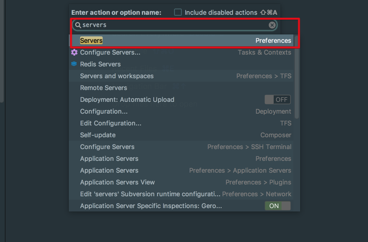
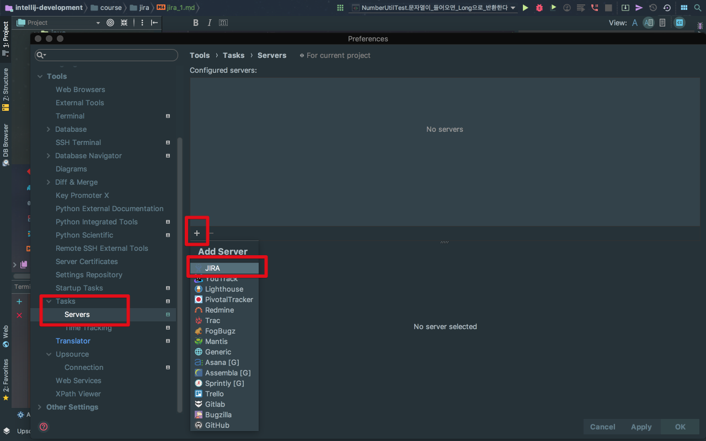
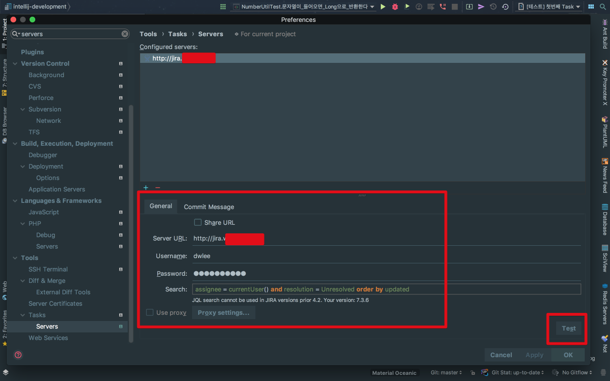
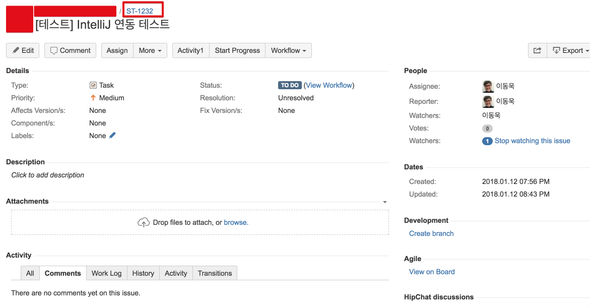
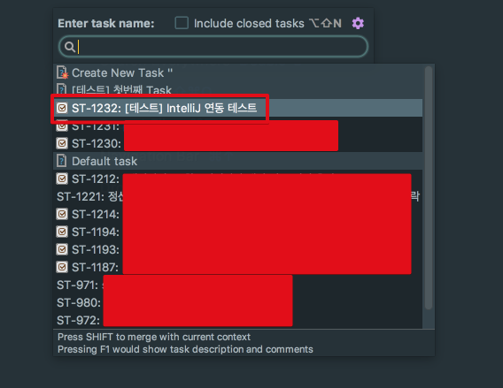
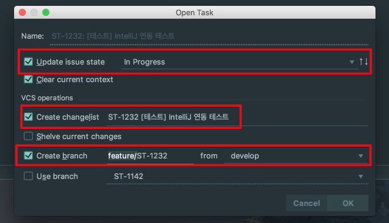
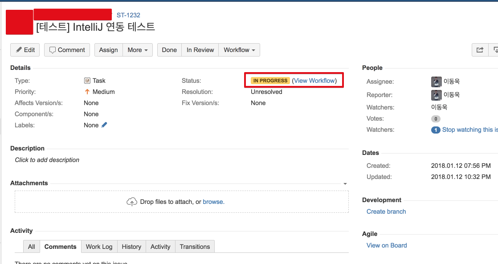
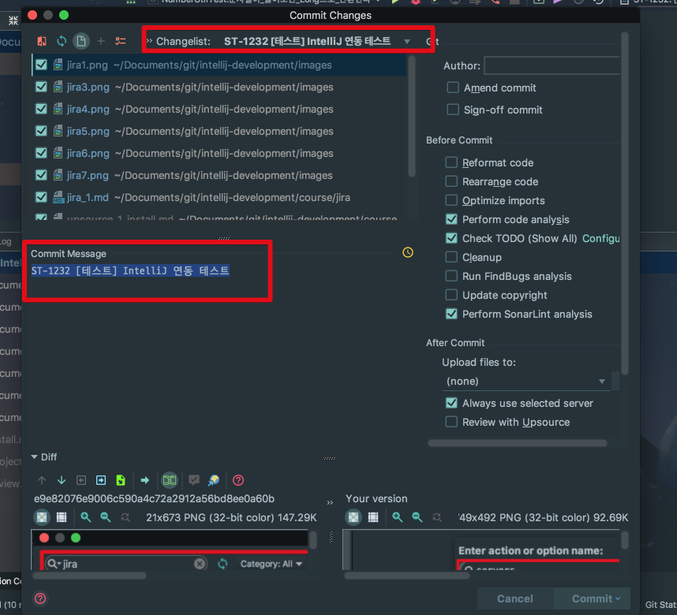
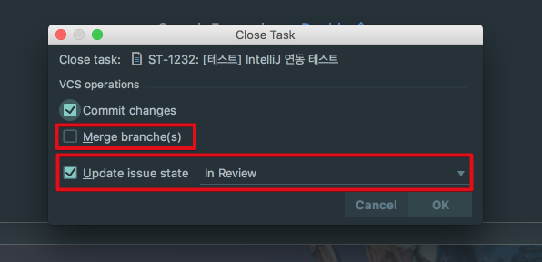

# IntelliJ & JIRA 연동

안녕하세요!  
이번 시간엔 IntelliJ로 이슈 트래커인 JIRA와 연동해서 업무를 진행하는 방법을 정리하겠습니다.  
  
보통 JIRA와 같은 이슈트래커를 쓰는 회사에서 업무는 다음과 같은 과정으로 진행됩니다.

1. **브라우저를 열어 이슈트래커 사이트로 가서** 티켓 상태를 In Progress로 변경합니다.
2. IDE에서 코딩합니다.
3. 어느 티켓을 위한 커밋인지 참고할 수 있도록 **커밋 메세지에 티켓 ID를 추가**해서 Git 커밋 합니다.
4. **티켓 상태를 In Review 상태로 변경** 후 코드리뷰 혹은 담당자에게 공유합니다.

매일 이렇게 업무를 진행하다보니, 별거 아닌 작은 일에 집중력이 흩어지고 반복 작업으로 귀찮아졌습니다.  
  
브라우저를 계속 열어놓고 티켓 상태를 변경시키는 것도,매 커밋마다 **메세지에 티켓 ID를 추가**하는게 귀찮아 IntelliJ 만으로 해결방법이 없을까 찾아보다가 발견하게 되어 정리하게 되었습니다.  
  
아래 내용은 모두 **IntelliJ의 기본 기능**으로 진행합니다.  

> Tip)  
공식 플러그인으로 [Atlasian Plugin](https://plugins.jetbrains.com/plugin/2190-atlassian-connector-for-intellij-ide)이 있지만 2015년까지만 업데이트 되고, 현재 IntelliJ 2017.3 버전에서 정상작동 하지 않습니다.  

**Mac OS를 기준**으로 하기 때문에 단축키가 윈도우/리눅스와는 다를 수 있습니다.

## 1. 기본 설정

IDE에서 Action 검색 -> servers를 입력하여 이동합니다.



(단축키: ```command+shift+a```)  
  
아래와 같이 설정 화면이 나오면 ```+``` 버튼을 클릭해 JIRA를 선택합니다.



(레드마인, 트렐로 등 다양한 이슈트래커들을 사용할 수 있습니다.)  
  
설정창에선 본인이 사용하는 JIRA 주소와 계정/비밀번호 등을 입력합니다.



**Search** 입력란은 Task 목록을 보여주는 방식을 얘기합니다.  
기본값으로 두었는데, 혹시 공란으로 나온다면 아래 코드를 복사해서 넣으시면 됩니다.

```sql
assignee = currentUser() and resolution = Unresolved order by updated
```

설정이 다 되시면 우측 하단의 **Test** 버튼을 클릭해서 **Connection is successful** 메세지가 보이시면 됩니다.  
  

기본 설정이 완료 되었으니 실제 업무 Flow대로 진행해보겠습니다.

## 2. 업무 Flow

현재 IntelliJ Task 기능으로는 **JIRA 티켓 생성이 안됩니다**.  
보통 기획/운영 쪽에서 티켓을 생성해 개발자에게 할당하고 개발이 시작되겠지만, 개발자가 티켓 생성해서 진행해야한다면 JIRA 사이트에서 생성하셔야만 합니다.  
  
저는 테스트용으로 미리 생성한 티켓으로 시작하겠습니다.



### 2-1. 기본 사용법

티켓 ID는 팀 규칙에 따라 ST-1232가 됩니다.  
자 그럼 이제 IDE에서 해당 티켓을 찾습니다.  
  
Mac OS 기준으로 ```option+shift+n``` 을 사용하시면 아래와 같이 본인에게 할당된 티켓 목록을 볼 수 있습니다.



여기서 저는 ST-1232 티켓을 처리할 예정이니, ST-1232 티켓을 선택합니다.  
그럼 아래와 같이 Task 창이 열립니다.  
**Update issue state**를 **In Progress**로 변경하고, 브랜치를 생성합니다.  
**브랜치명은 티켓ID가 자동 지정**됩니다.  
여기선 ST-1232가 자동으로 브랜치명이 되는것을 확인할 수 있습니다.



(기능 단위 브랜치는 앞에 feature를 붙이기 때문에 feature/ST-1232로 생성합니다.)  
  
git console과 IDE에서 feature/ST-1232가 생성된 것을 확인할 수 있습니다.


JIRA 사이트에 가서 상태가 변경되었는지도 확인합니다.



자 이제 개발이 완료되면 커밋을 진행합니다.  
Mac OS 기준으로 ```command+k```를 사용합니다.



보시면 **커밋 메세지가 자동 생성**된 것을 확인할 수 있습니다.  
기본 옵션으로 커밋 메세지는 **티켓ID + 제목**입니다.  




### 2-2) 커밋 메세지 템플릿


## 참고

* [Working with JIRA Issues in IDEA](https://confluence.atlassian.com/display/IDEPLUGIN/Working+with+JIRA+Issues+in+IDEA)