# .http를 사용해 Postman 대체하기

안녕하세요! 이번 시간엔 IntelliJ의 ```.http``` 파일을 어떻게 사용하는지 소개드리겠습니다.  
모든 코드는 [Github](https://github.com/jojoldu/intellij-development)에 있습니다!

## 소개

프로젝트를 계속 운영하다보면 로컬 환경외에 **개발/운영 환경에서 API 요청이 잘되는지 확인**이 필요할때가 많습니다.  
  
* 베타/운영 서버의 A API 값이 안나와요. 확인좀 해주세요.
* 베타 서버의 B API 사용해보려면 어떻게 해야 하나요?
* 전에 사용했던 API URL과 인증키가 어떻게 되나요?
  
등등의 요청이 많은데요.  
특히 인증 토큰등을 사용하는 경우나, 쿠키가 필요한 경우와 같이 Request 방식이 복잡하거나 할때는 대략 난감할때가 종종 있습니다.  
  
물론 [Swagger](http://jojoldu.tistory.com/31)와 같은 API 프레임워크를 사용할수 있겠지만, 회사 팀 단위로 쓸때는 바로 적용하기 어려울때도 있고 당장 급할때 적용하기가 부담스러울수도 있습니다.  
  
이런 문제점들로 계속 Postman만 사용해오셨다면, IntelliJ 2017.3 버전부터 지원하게 된 ```.http``` 를 사용해보시는걸 추천드립니다.

## 장점

앞으로 소개드릴 ```.http```의 장점은 크게 2가지가 있다고 생각합니다.

### IntelliJ 기능 지원

IntelliJ에서 작성하기 때문에 아래의 기능들이 모두 지원됩니다.

* Code highlighting
* 코드 자동 완성
* 직관적인 HttpRequest 구조
* Request Body에 쓸 JSON 등 적극적 지원 (Language injections)
* 리팩토링

IntelliJ로 코드를 작성할때 얻는 장점이 모두 포함됩니다.

### 파일 관리

모든 요청이 ```.http```라는 파일로 관리 되기 때문에 **Git으로 관리**할 수가 있습니다.  
이건 특히나 큰 장점인데요.  
A라는 사람이 만든 ```.http```는 Git Push만 하면 누구든 사용할수 있게 되고, 혹시나 누가 삭제했다 하더라도 언제든지 Git History를 통해 되살릴수 있습니다.  
API 요청 방법의 변경 내역도 언제든지 확인할 수 있습니다.  

## 사용법

간단한 예제부터 하나씩 진행해보겠습니다.

### 1. 기본 GET 요청

가장 먼저 ```.http``` 파일을 생성해보겠습니다.  
프로젝트 폴더 구조에서 ```command+n```(Mac OS 기준)으로 new 메뉴를 열어 **HTTP Request**를 선택하고 파일명을 입력합니다.  

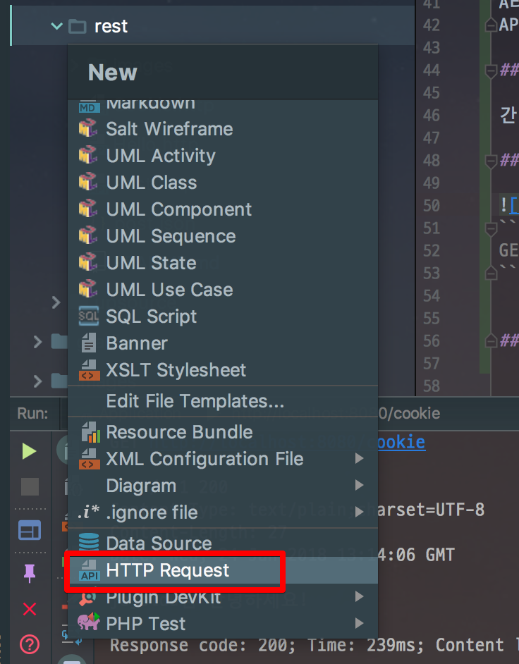

그럼 아래와 같이 (저는 파일명을 Hello로 했습니다.) ```.http```파일이 생성됩니다.  

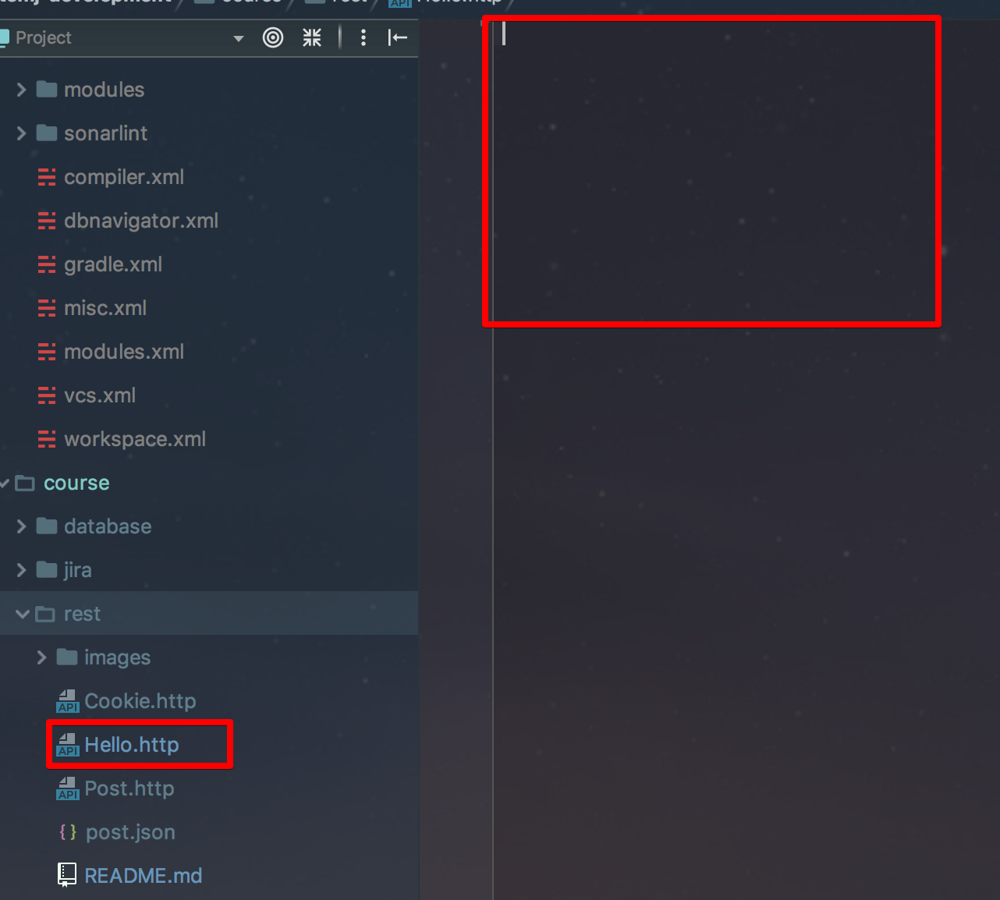

여기에 간단하게 GET 요청을 한번 날려보겠습니다.  
사용법은 간단합니다.  
Http Request 스펙처럼 작성해주시면 됩니다.

```
GET https://www.devbeginner.com
```

> Tip)  
즉, 파일의 **첫줄에는 HTTP Method와 URL**을,
**둘째줄부터는 RequestHeader** 부분을 작성해주시면 됩니다.

작성하셨으면 실행을 해야하는데요.  
아래와 같이 URL 위치에 Focus를 두고, ```option+enter```(Mac OS 기준)을 실행하면 **Run URL**이 등장합니다.  
바로 엔터를 치면 실행됩니다.


요청의 결과가 바로 IntelliJ 화면 하단에 등장합니다!

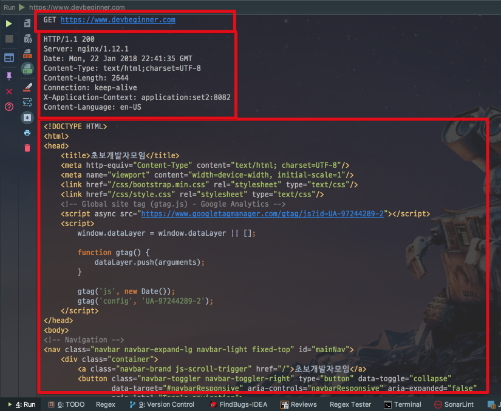

브라우저의 개발자도구로 보는것처럼 Response Header와 Body가 상세하게 나오는데요.  
특히 **HTML이 반환될때는 IntelliJ의 코드 하이라이팅이 그대로 적용**되서 보이기 때문에 굉장히 직관적입니다.  
자 그럼 이제 좀 더 다양한 Request 방법을 사용해보겠습니다.

### 2. Post 요청

이번엔 JSON 데이터를 Post 요청해보겠습니다.  
테스트 Request 요청을 받아줄 간단한 RestController를 생성하고 테스트를 진행하겠습니다.

```java
@RestController
public class PostController {

    @PostMapping("/group")
    public GroupDto post(@RequestBody GroupDto groupDto){
        return groupDto;
    }

    @Setter
    @Getter
    @NoArgsConstructor
    private static class GroupDto {
        private String groupName;
        private List<String> members;
        private DateObj date;

        @Setter
        @Getter
        @NoArgsConstructor
        private class DateObj {
            private int year;
            private int month;
            private int day;
        }
    }
}
```

빠르게 클래스를 생성후, SpringBoot로 localhost:8080으로 실행합니다.  
그리고 ```.http``` 파일에 다음과 같이 JSON POST 요청 코드를 작성합니다.

```
### 직접 JSON 사용
POST http://localhost:8080/group
Content-Type: application/json

{
  "groupName": "그룹명",
  "members": [
    "회원1",
    "회원2",
    "회원3"
  ],
  "date": {
    "year": 2018,
    "month": 1,
    "day": 24
  }
}
```

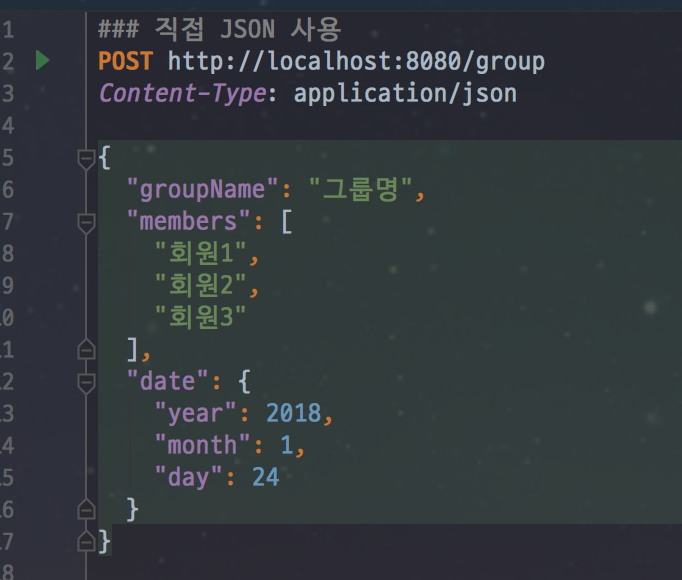

흔히 사용하는 JSON과 동일한 형태로 작성하면 됩니다.  
보시면 ```Content-Type``` 역시 간단하게 지정할 수 있습니다.  
이렇게 해서 요청을 보내보시면!

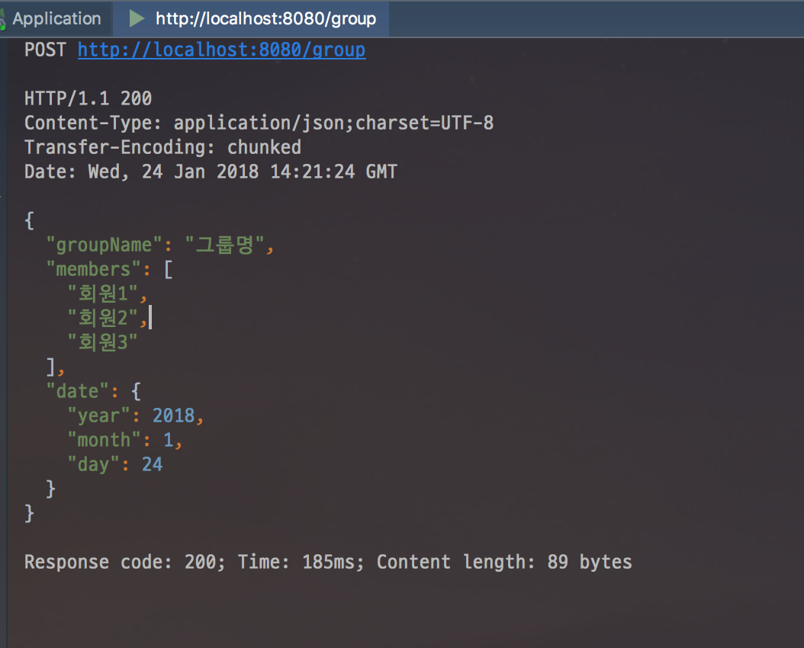

아주 잘 수행됐음을 알 수 있습니다.  
자 여기서 Post 예제를 하나더 진행해보겠습니다.  
  
Post로 JSON 데이터를 보낼때는 복잡한 형태가 많아서 실제 파일채로 보내고 싶을때가 있습니다.  
IntelliJ의 ```.http```는 파일 데이터도 그대로 보낼 수가 있습니다.  
예제로 ```post.json``` 파일을 하나 만들겠습니다.

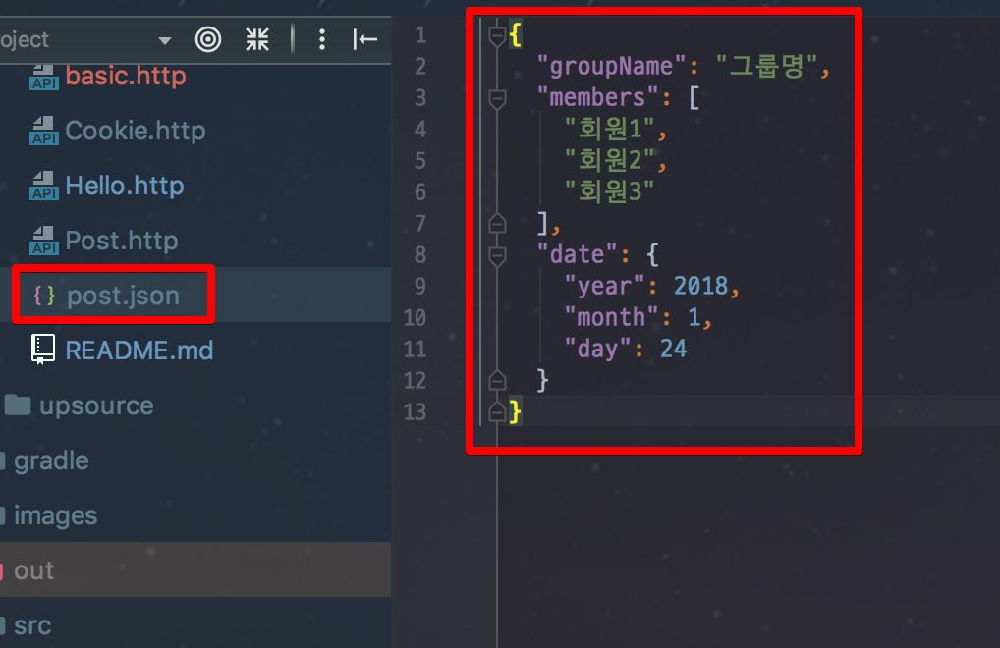

그리고 이 파일을 보낼 코드는 아래와 같습니다.

```
### 로컬 파일 사용

POST http://localhost:8080/group
Content-Type: application/json

< ./post.json
```

꺽쇠(```<```)를 기준으로 파일 위치를 지정하시면 해당 파일의 데이터를 전송합니다.  

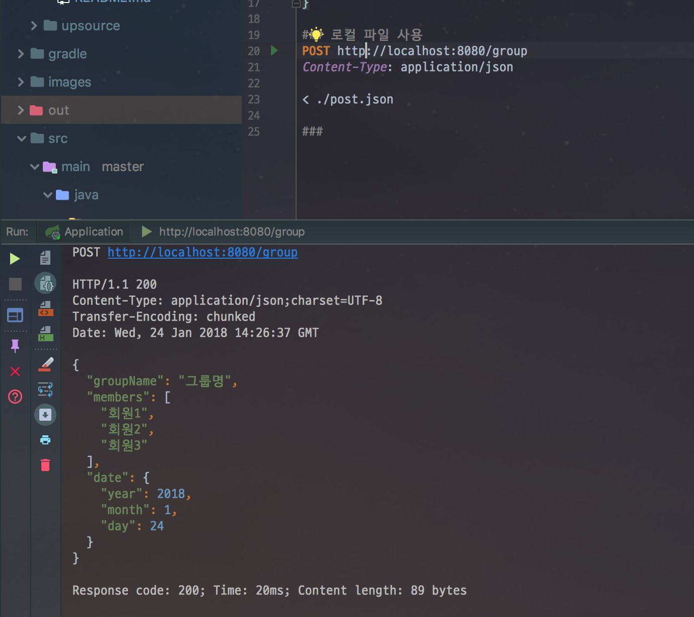

JSON 데이터가 잘 넘어갔습니다!  
  
Request Header와 데이터형태를 변경하면 [multipart/form-data와 같이 파일 업로드, 이미지 업로드](https://www.jetbrains.com/help/idea/rest-client-in-intellij-idea-code-editor.html) 등의 API도 쉽게 테스트할수 있겠죠?

### 3. Request Header 수정

이번엔 Request Header에 특정 필드를 추가해서 요청하는 기능을 테스트하겠습니다.  
예를 들어, 서버간 JSON API 통신에서는 인증키를 Request Header에 심어서 주고 받습니다.  
운영에서 사용중인 API를 갑자기 테스트해야할때면 Request Header에 심어야하는데요.  
Postman으로 테스트하기에 어려운점이 많아 [Mod Header](https://chrome.google.com/webstore/detail/modheader/idgpnmonknjnojddfkpgkljpfnnfcklj) 등을 사용했습니다.  
이런 기능들도 ```.http```로 해결해보겠습니다.  
  
역시 추가로 간단한 RestController를 하나 만들어서 진행하겠습니다.

```java
@RestController
public class HelloController {

    @GetMapping("/hello")
    public String hello() {
        return "hello";
    }

    @GetMapping("/dev/hello")
    public String devHello(HttpServletRequest request) {
        String auth = request.getHeader("Authorization");

        if(!"DEV".equals(auth)){
            throw new AccessDeniedException();
        }

        return "devHello";
    }

    @GetMapping("/real/hello")
    public String realHello(HttpServletRequest request) {
        String auth = request.getHeader("Authorization");

        if(!"PRODUCTION".equals(auth)){
            throw new AccessDeniedException();
        }

        return "productionHello";
    }

    @ResponseStatus(HttpStatus.UNAUTHORIZED)
    static class AccessDeniedException extends RuntimeException {

    }
}
```

위 코드는 간단합니다.  
Request Header에 있는 ```Authorization```값을 보고 지정한 값이 아니면 401 Exception을 반환합니다.  

> Tip)  
실제라면 SpringSecurity 혹은 인터셉터등을 통해서 인증키값을 검증해야합니다.

그리고 테스트할 ```.http```의 내용은 아래와 같습니다.

```
### 로컬
GET http://localhost:8080/hello

### 개발 오류
GET http://localhost:8080/dev/hello

### 개발 정상
GET http://localhost:8080/dev/hello
Authorization: DEV

### 운영
GET http://localhost:8080/real/hello
Authorization: PRODUCTION

```

개발 오류부분부터 먼저 실행해보겠습니다.

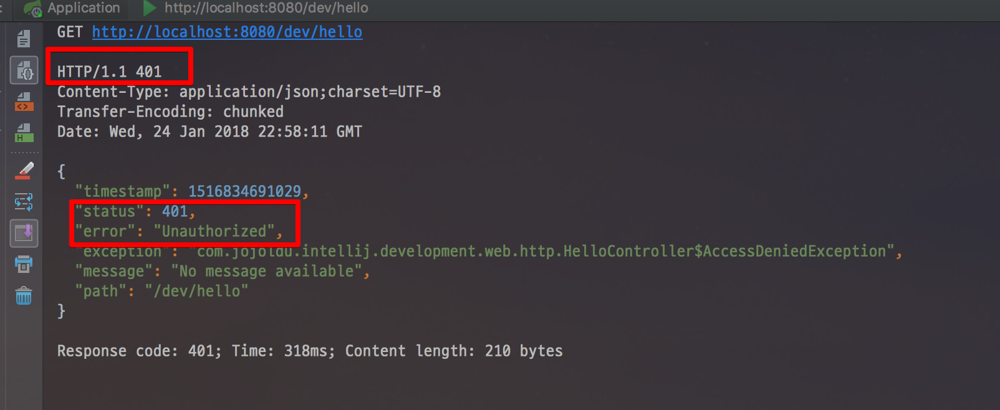


인증헤더값이 없어 정상적으로 401 에러를 반환합니다.  
자 그럼 인증 헤더를 담은 개발 정상 요청을 해봅니다.

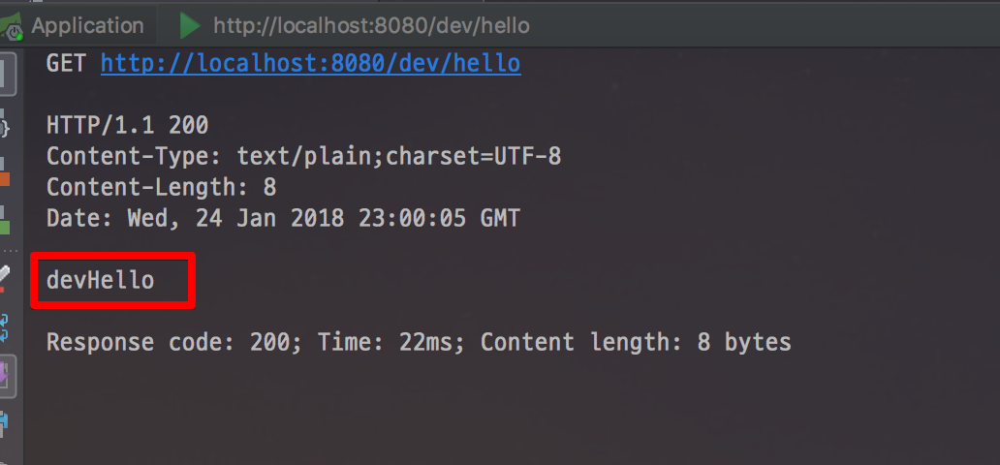

인증 헤더값이 정상적으로 작동하는걸 확인할 수 있습니다!

### 4. Cookie 수정

3번과 마찬가지로 Cookie에 특정값을 넣어서 테스트할 경우 사용할 수 있습니다.  
간단한 Controller 부터 생성하신뒤,

```java
@RestController
public class CookieController {

    @GetMapping("/cookie")
    public String getCookie(@CookieValue("user") String user) {
        return user+"님 안녕하세요!";
    }
}

```

cookie의 경우 문법은```key=value```방식으로 작성하시면 됩니다.  
 ```.http```파일엔 다음과 같이 코드를 작성하겠습니다.

```
### Cookie
GET http://localhost:8080/cookie
Cookie: user=jojoldu
```

user라는 Key에 ```jojoldu```라는 값을 넣고 실행해보시면!

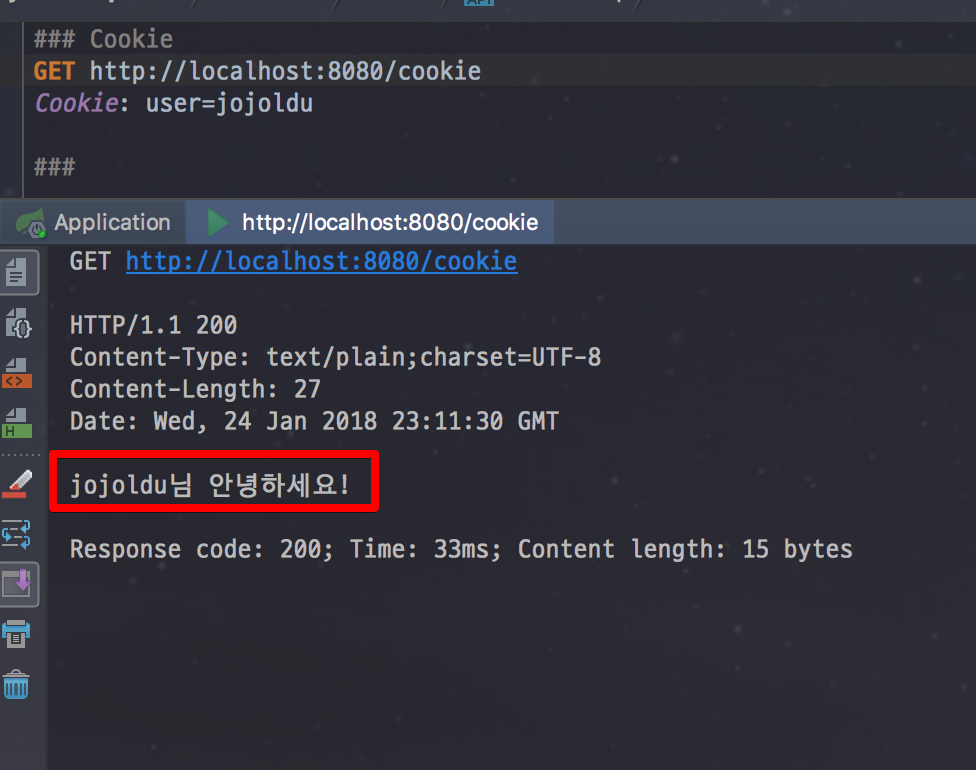

Controller에서 Cookie값을 받아 반환하는 것이 확인됩니다.

### 5. log

IntelliJ의 ```.http``` 요청은 모두 로그로 남기고 있습니다.  
Response Body가 너무 많을 경우엔 IntelliJ 화면에서 끊길수가 있습니다.  
이럴때 로그 파일로 확인하시면 좋습니다.  
로그 파일의 위치는 ```프로젝트폴더/.idea/httpRequests/``` 아래에 모두 있습니다.

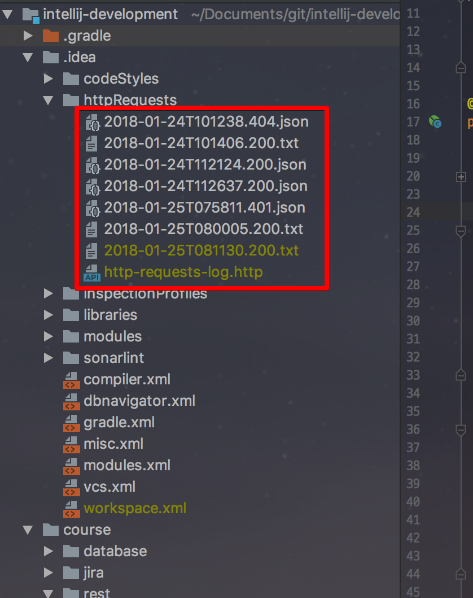

여기서 ```http-requests-log.http```는 ```.http```를 통
그외 나머지 ```.json```, ```.txt```는 Response 결과들입니다.

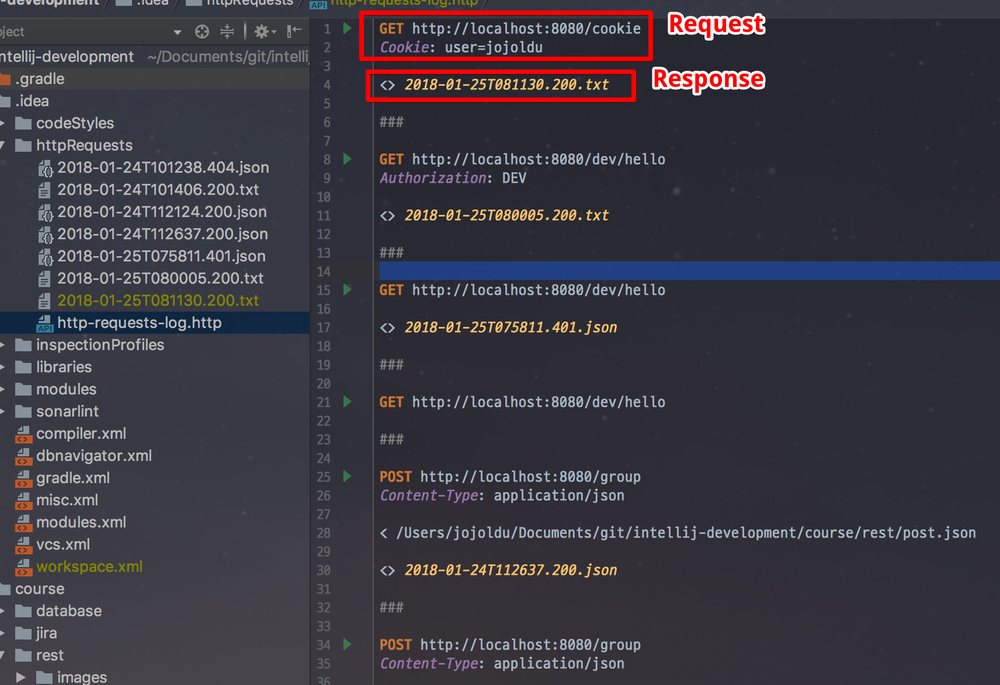

(```http-requests-log.http```)

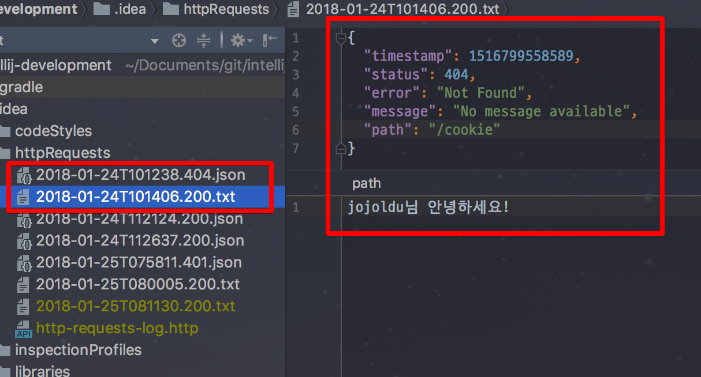

(JSON응답은 ```.json```으로, 그외 HTML, 문자열등의 응답은 ```.txt```로 남깁니다.)  

### 6. Controller로 자동생성

[2018.1 버전부터 추가](https://blog.jetbrains.com/idea/2018/01/whats-new-in-intellij-idea-2018-1-eap-4/)되는 기능입니다.  
  
Controller를 기반으로 ```.http```파일을 자동생성해줍니다.

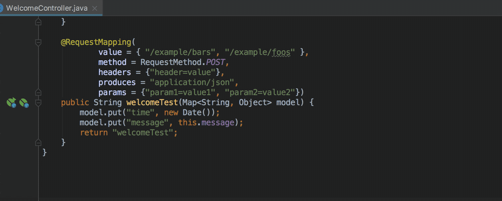

2018.1 EAP부터 사용가능하다고해서 EAP버전으로 올려서 테스트해봤지만 **현재(2018.01.25)** 는 기능이 작동되지 않고 있습니다.  
문의는 드린 상태인데 혹시나 변경 사항이 있으면 수정해놓겠습니다!

## 마무리

어떠셨나요?  
그간 Postman을 사용하면서 만났던 불편함이 어느정도 해소되셨나요?  
개인적으로 IntelliJ의 2017.3 버전에 추가된 기능 중 가장 마음에 드는 기능입니다.  
점점더 IntelliJ가 진짜 IDE (통합 개발 환경)이 되는것 같습니다.  
또 좋은 기능과 플러그인을 발견하게 되면 정리해서 공유드리겠습니다.  
고맙습니다^^

## 참고

* [REST Client in IntelliJ IDEA Code Editor](https://www.jetbrains.com/help/idea/rest-client-in-intellij-idea-code-editor.html)