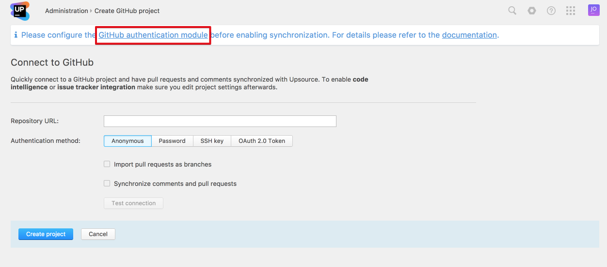
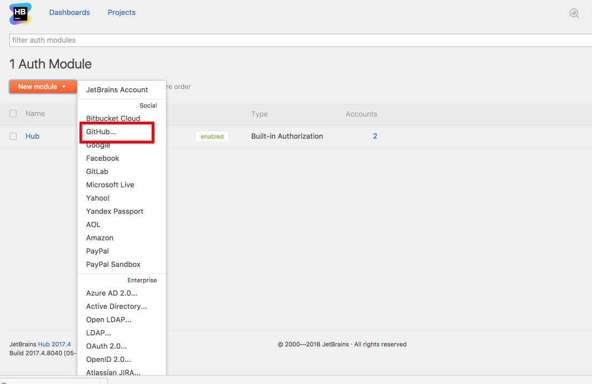
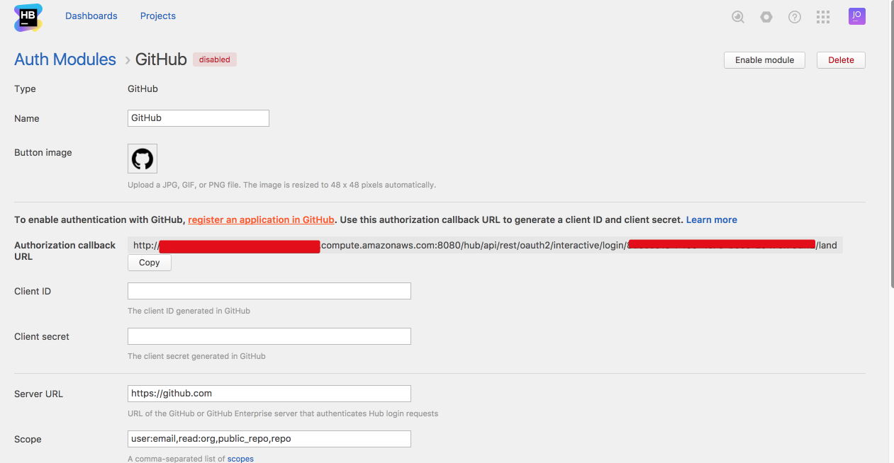
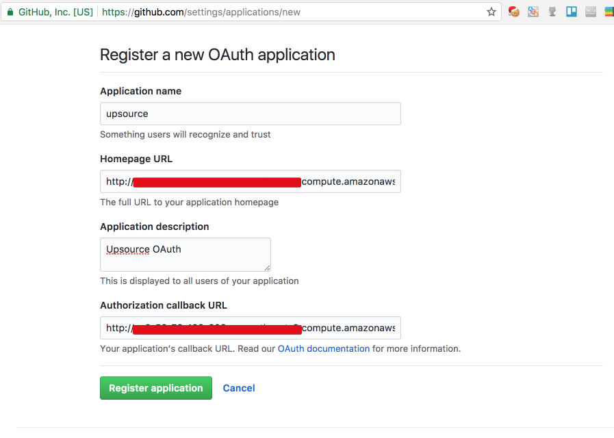
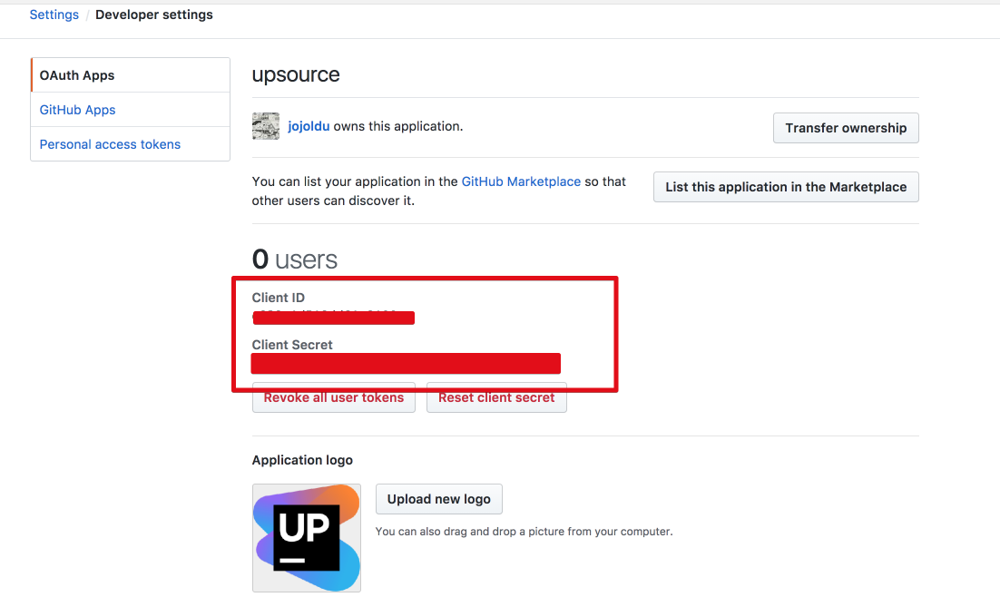
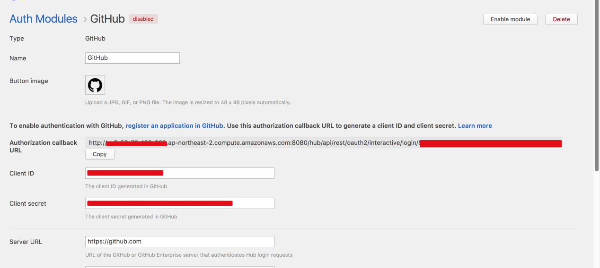
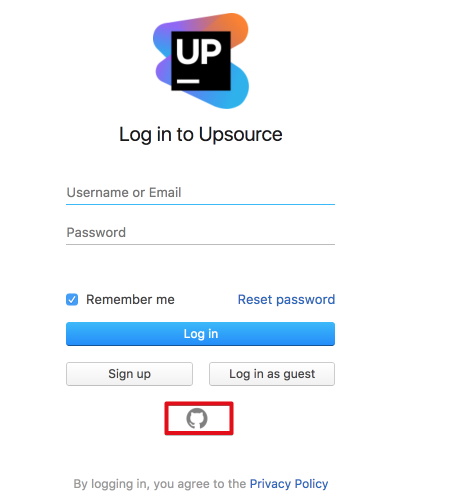
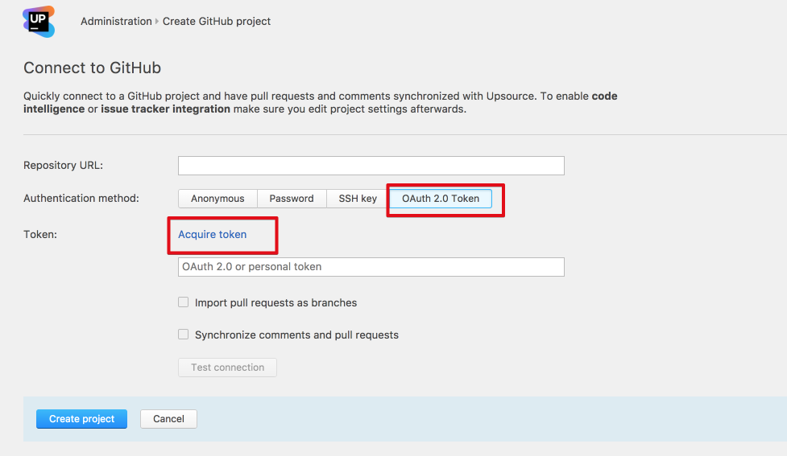
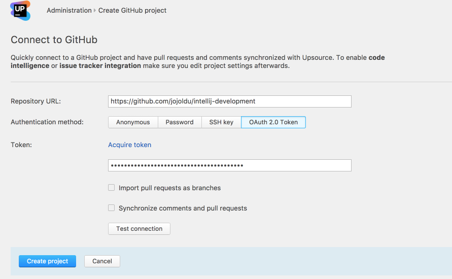
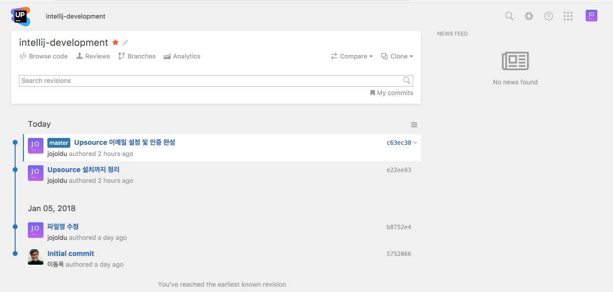

# 2. Upsource Github & IDE 연동

지난 1부에 이어 Github, IntelliJ IDEA와 Upsource 연동 과정을 진행하겠습니다.

## 2-1. Github

Github 연동은 2가지가 있습니다.  
Github 로그인 연동과 프로젝트 연동입니다.  
2개 모두 진행하겠습니다.
  
### 1) Github 인증 모듈 연동

Github 연동이 안되있기 때문에 Dashboard에선 아래와 같이 Github 연결 안내 문구가 등장합니다.  
**connect to a GitHub project**를 클릭합니다.  

Github 프로젝트 페이지에서는 아직 Github 모듈 연동이 안되있다는 메세지와 함께 설정하라는 메시지가 등장합니다.  
**Github authentication module** 버튼을 클릭합니다.

Auth Module 페이지에서 New module 셀렉트 박스를 클릭해 **Github...** 를 선택합니다.

Github Auth 페이지가 나오는데요, 여기서 **register an application in Github**을 클릭합니다.

본인의 Github Application 페이지로 이동되는데, 여기서 항목을 다 채우시고, 마지막 Authorization callback URL 은 방금전 Upsource Github Auth 페이지의 **Authorization callback URL**을 복사해서 붙여넣습니다.  

**Register application**을 클릭하시면 Application 이 생성됩니다.  
Application 페이지의 Client ID, Client Secret 값을 복사해서 

Github Auth페이지에 등록합니다.

이러면 Github 인증 모듈 연동은 끝났습니다!  
아래와 같이 로그인 페이지로 다시 가보시면

Github 로그인 버튼이 추가되었습니다.  
관리자 계정을 제외한 다른 계정들은 앞으로 **Github 로그인**을 통해 로그인하시면 됩니다.  

### 2) Github 프로젝트 연동

로그인 작업이 완료되었으니, 프로젝트를 연동하겠습니다.  
Dashboard의 **connect to a GitHub project**를 클릭합니다.  
아래와 같이 Github 저장소 등록 페이지에서 OAuth 2.0 Token을 클릭하신뒤, **Acquire token**을 클릭합니다.

그럼 현재 Github에 로그인된 계정의 OAuth 토큰을 요청하게 됩니다.  
(연결하고자하는 프로젝트가 있는 Github 계정으로 로그인된 상태여야만 합니다.)  
  
토큰 발급이 완료되면 아래와 같이 Token 입력란이 암호화되서 채워지게 됩니다.  

Repository URL에 등록하고자하는 Github 프로젝트의 URL을 입력하고 **Create project** 버튼을 클릭합니다.  
  
그럼 아래와 같이 성공적으로 등록된것을 확인할 수 있습니다!

해당 프로젝트를 클릭해보시면, 아래와 같이 커밋된 내역을 확인할 수 있습니다.

### 3) 코드리뷰 신청하기

## 2-2. IntelliJ IDEA

