# 3. Upsource 코드리뷰

[지난 2부](http://jojoldu.tistory.com/257)에 이어 이번시간엔 Upsource로 코드리뷰를 진행해보겠습니다.  

## 3-1. Github Sync 주기 설정

코드리뷰를 진행하기 전에 한가지 설정을 먼저 하고 진행하겠습니다.  
Github과 Upsource의 **Sync 주기가 기본이 5분(300초)**로 잡혀있습니다.  
그래서 실제 코드가 Upsource에 반영되기가 조금 시간이 필요한데요.  
이 주기를 **30초**로 줄이겠습니다.  
  
프로젝트 페이지의 우측 상단 나사 버튼을 클릭합니다.


**Edit project** 를 클릭합니다.


300초로 되어있는 Check interval을 30으로 변경합니다.


**Save changes**를 클릭하면 설정이 완료됩니다.

## 3-2. 코드리뷰 

코드리뷰를 위해 Github 계정을 하나더 필요합니다.  
(리뷰어가 필요하기 때문입니다.)  
  
### 1) 프로젝트 참가 계정 추가

Github에서 계정 하나를 더 만드셨다는 가정하에 진행하겠습니다.  
다른 Github 계정 역시 설치한 Upsource 주소로 접근해 **Github 로그인**을 진행합니다.  
(관리자만 직접 로그인을 하고, 그외 계정은 Github 로그인 하시면 됩니다.)  
  
아래와 같이 가입된 계정이 2개 이상이시면 됩니다.


(Upsource 도메인 뒤에 ```/hub/users```를 붙이시면 해당 페이지로 이동합니다.)  

방금 가입한 2번째 계정을 샘플 프로젝트에 참가시키겠습니다.  
Upsource 도메인 뒤에 ```/hub/projects```를 붙이시면 아래와 같이 Projects 페이지로 이동됩니다.


여기서 원하는 프로젝트를 클릭하시면 해당 프로젝트와 관련된 설정을 할 수 있는 페이지로 이동합니다.  
**Add user or group** 버튼을 클릭해, 2번째 계정을 프로젝트 참가자로 등록합니다.

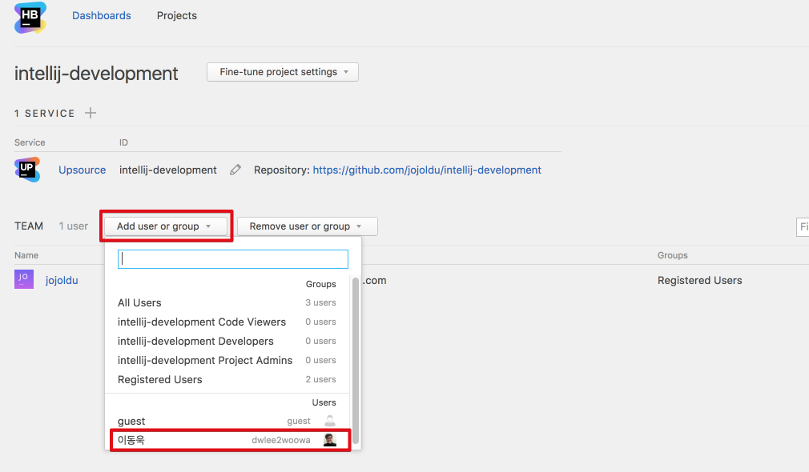

아래와 같이 2명이 등록된 것이 확인이 되시면 끝난 것입니다.

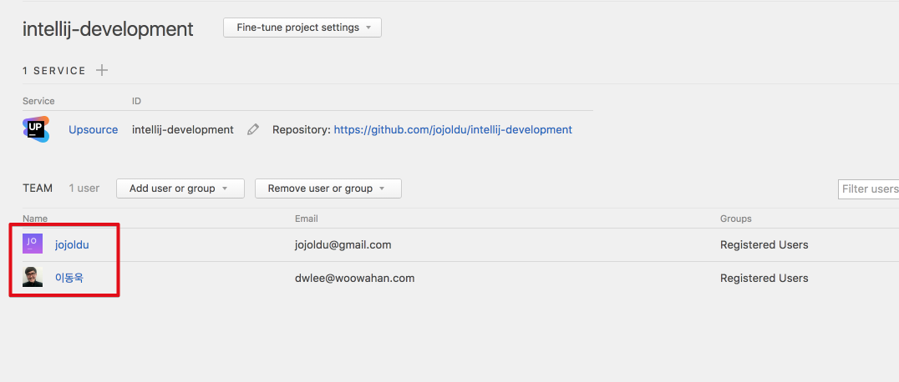

간단한 코드를 작성해서 리뷰 신청을 진행하겠습니다.

### 2) 리뷰 신청 

테스트를 위해 프로젝트에 ```feature/add-LocalDateUtil```이란 브랜치를 생성해 간단한 테스트 코드를 작성해서 commit & push하겠습니다.


push후, Upsource 프로젝트 페이지로 가보시면 아래와 같이 브랜치와 커밋이 올라온 것을 확인할 수 있습니다.

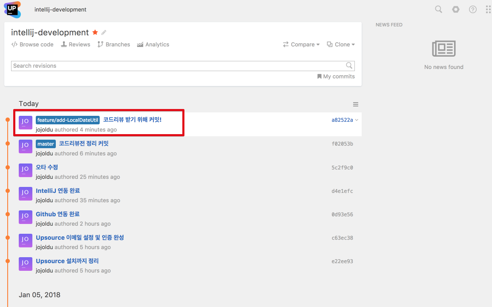

위 브랜치를 클릭하시면 아래와 같이 브랜치 페이지로 이동합니다.  
여기서 **create branch review** 버튼을 클릭합니다.

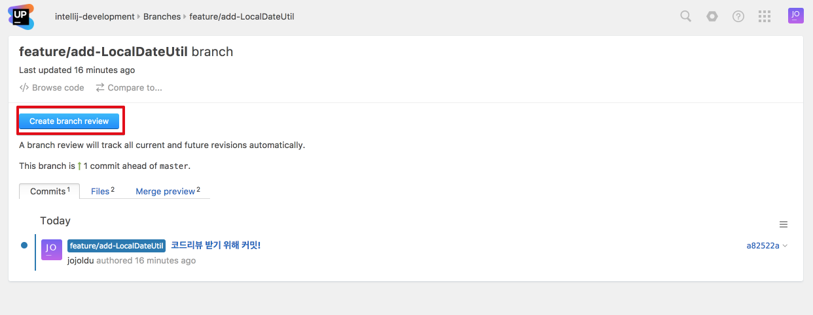

해당 브랜치의 코드리뷰 페이지가 생성됩니다.  
좌측을 보시면 **Reviewers +** 버튼을 클릭하시면, 아래와 같이 리뷰어 등록 Modal이 열립니다.  

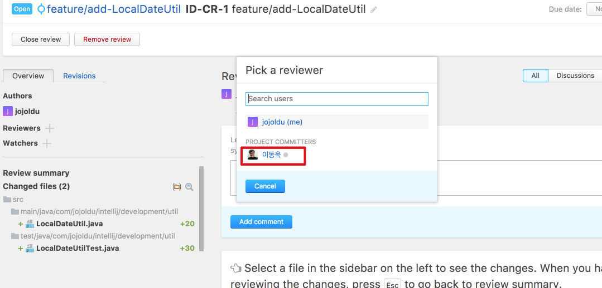

2번째 계정을 리뷰어로 등록합니다.

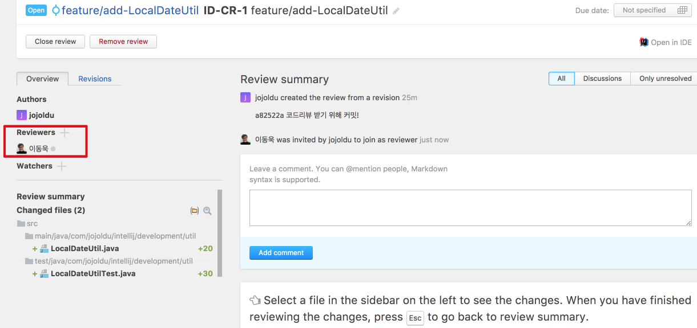

자 그럼 이제 리뷰어로 등록된 2번째 계정으로 Upsource 페이지에 접속해 코드리뷰를 진행하겠습니다.

### 3) 리뷰어 코멘트

리뷰어로 등록된 2번째 계정으로 Upsource 에 접속해보시면 아래와 같이 리뷰 신청이 온것을 확인할 수 있습니다.

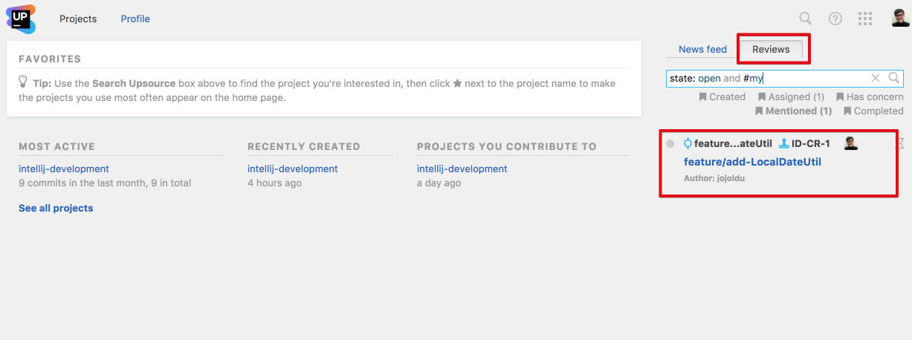

리뷰 브랜치를 클릭하셔서 코드리뷰를 시작합니다.  

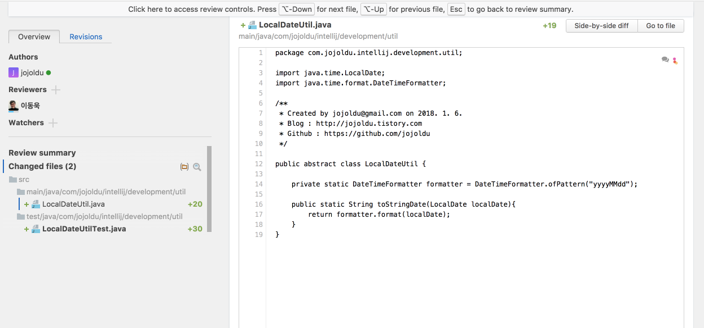

17라인의 코드가 이상하니 해당 라인에 코멘트를 달겠습니다.

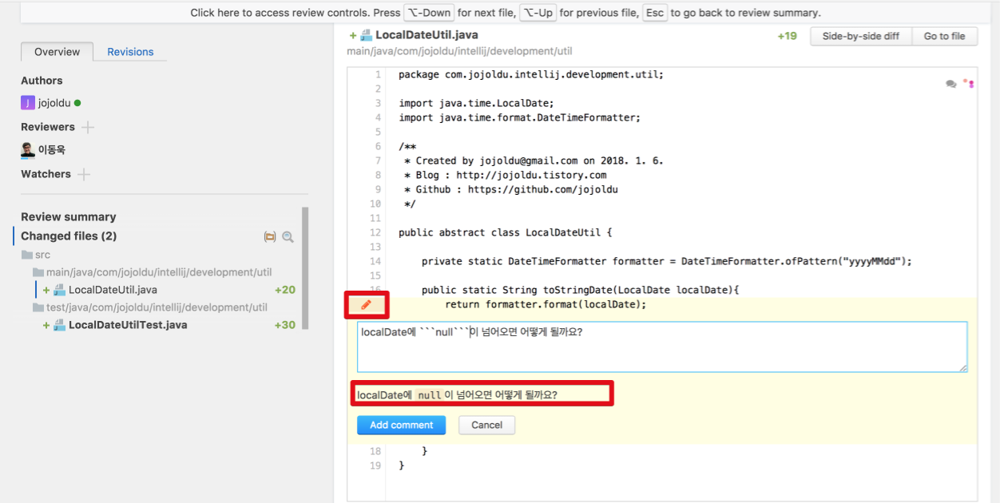

코멘트는 기본적으로 마크다운 문법을 지원합니다.

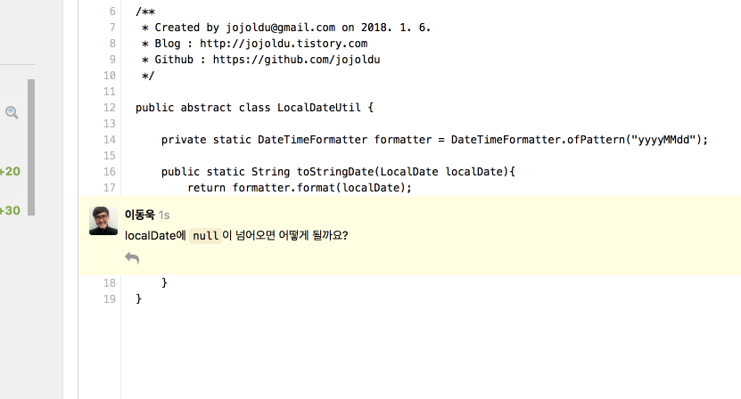

코멘트가 정상적으로 등록 되었습니다.

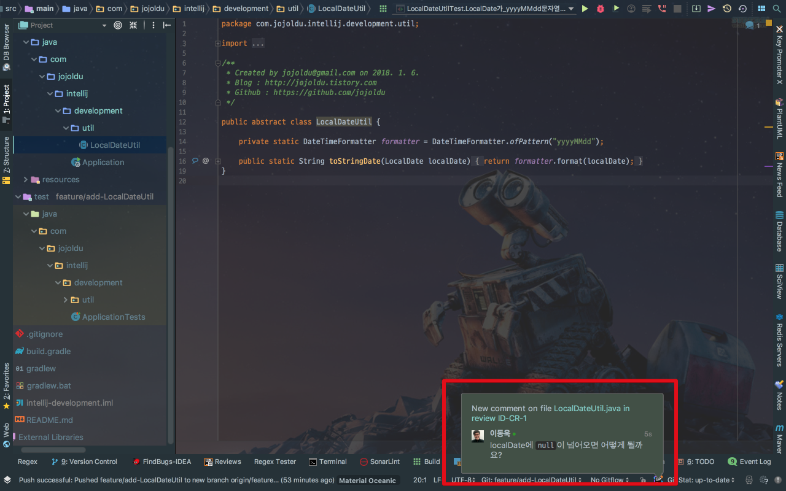

### 4) 리뷰이 IDE

코드리뷰를 요청한 사용자는 본인의 코드리뷰에 코멘트가 달리는 순간!  
아래와 같이 IDE에 즉각 반응이 옵니다.

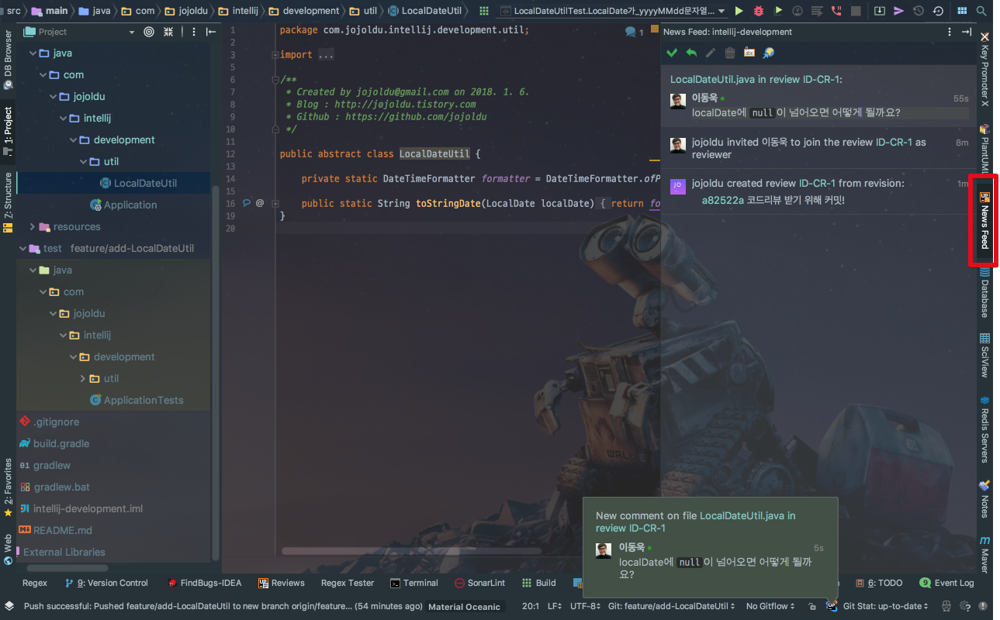

만약 다른 파일을 열어둔 상태에서 해당 코멘트가 달린 파일로 이동하고 싶으시다면, 코멘트 위 리뷰번호 (여기선 ```ID-CR-1```)을 클릭하셔서 **Open Local File**을 클릭하면 바로 해당 파일로 이동합니다.

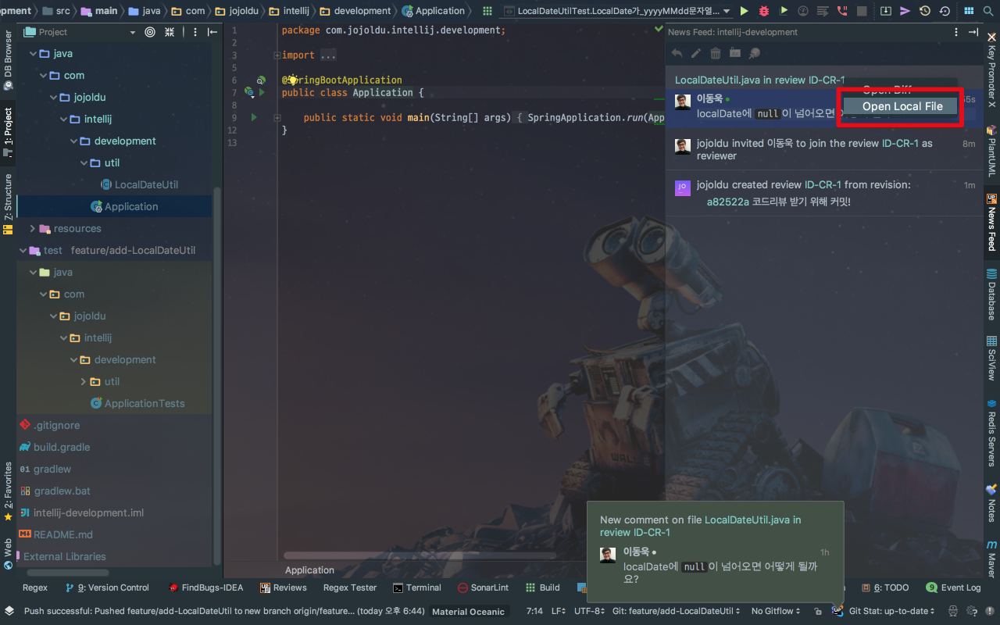

코멘트가 달린 파일에선 좌측 라인번호에 코멘트 표시가 추가됩니다.

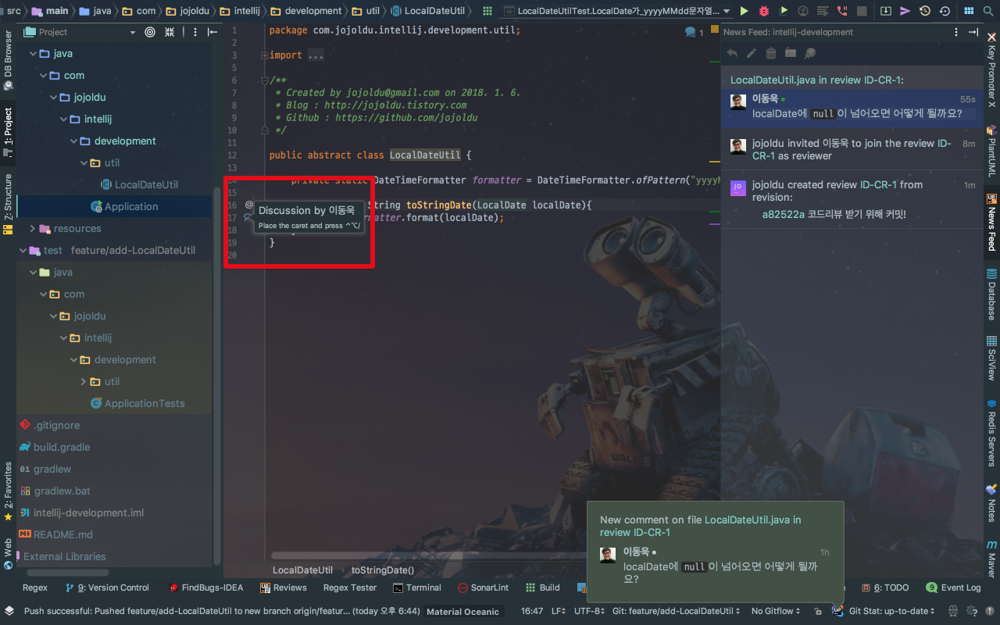

우측 화면의 리뷰 코멘트에서 바로 댓글을 추가할 수 있습니다.

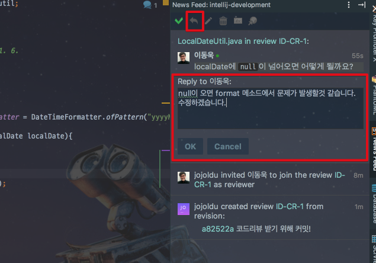

리뷰어의 화면에선 본인이 리뷰하지 않은 파일엔 Bold가 처리됩니다.

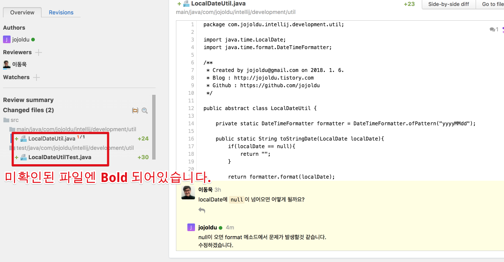

요청자의 코드가 잘 수정되어 더이상 리뷰할 내용이 없다면 화면 상단의 **Accept** 버튼을 클릭해 리뷰 승인을 합니다.

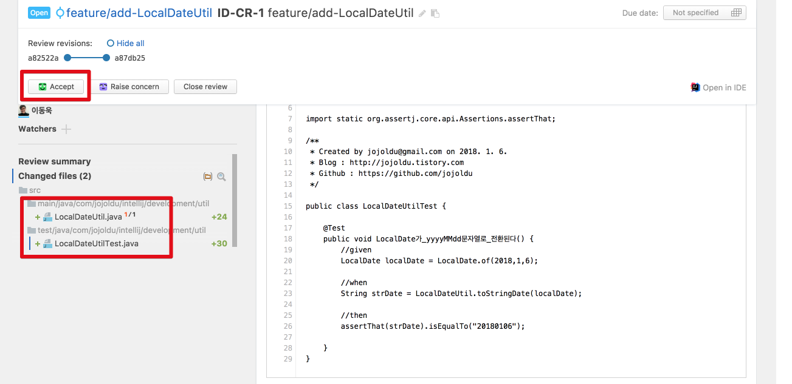

모든 리뷰어가 **Accept**를 하면 리뷰 요청자는 해당 리뷰를 Close할 수 있습니다.  

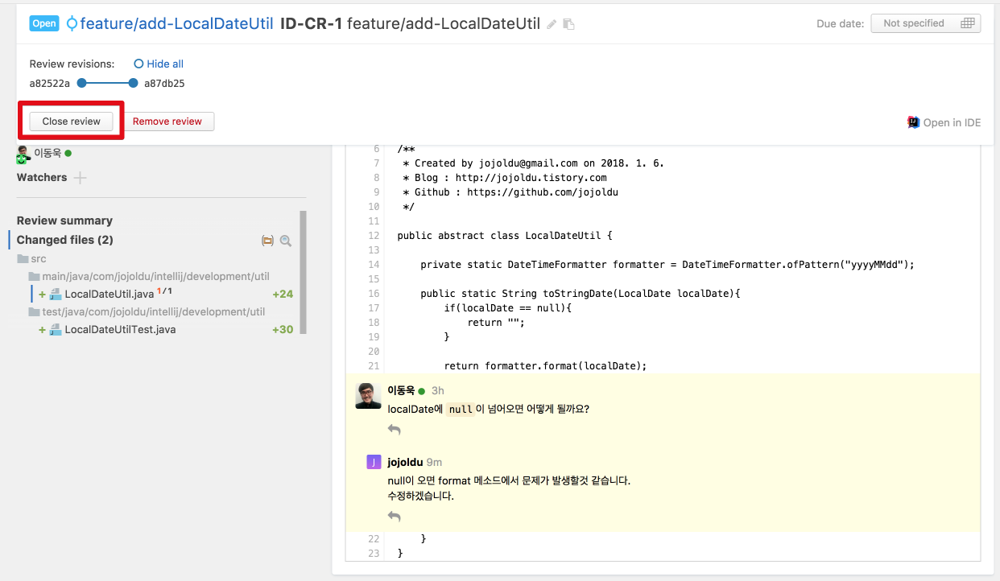

마지막 Close 까지 진행하면 코드리뷰가 종료됩니다.

## 3-3. Pull Request


